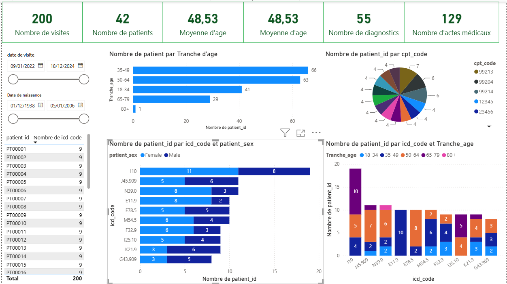

# 🏥 Tableau de Bord — Visites & Diagnostics Médicaux

> Analyse exploratoire de données de visites médicales avec Power BI

---

## 📌 Aperçu du projet

Ce projet de Business Intelligence vise à analyser des données de visites médicales issues d'un fichier CSV structuré. Le tableau de bord Power BI produit offre une vue synthétique et interactive des indicateurs clés : profils démographiques des patients, diagnostics les plus fréquents et actes médicaux réalisés.

---
## 📊 Aperçu du Dashboard
 

 
---
## 📊 Indicateurs clés (KPIs)

| Indicateur | Valeur |
|---|---|
| Nombre de visites | **200** |
| Nombre de patients | **42** |
| Moyenne d'âge | **48,53 ans** |
| Nombre de diagnostics distincts (ICD) | **55** |
| Nombre d'actes médicaux distincts (CPT) | **129** |
| Tranche d'âge dominante | **35–49 ans** |

---

## 🗂️ Source des données

**Fichier :** `patient_visits.csv`

| Colonne | Type | Description |
|---|---|---|
| `visit_id` | Texte | Identifiant unique de la visite |
| `patient_id` | Texte | Identifiant unique du patient |
| `visit_date` | Date | Date de la visite médicale |
| `date_of_birth` | Date | Date de naissance du patient |
| `patient_age` | Entier | Âge du patient au moment de la visite |
| `patient_sex` | Texte | Sexe du patient (Male / Female) |
| `icd_code` | Texte | Code ICD du diagnostic posé |
| `cpt_code` | Texte | Code CPT de l'acte médical réalisé |

**Volumétrie :**
- 200 enregistrements de visites au total
- Période couverte : Janvier 2022 – Décembre 2024
- 42 patients uniques identifiés (PT00001 à PT00042)
- 55 codes de diagnostic ICD distincts
- 129 codes d'actes médicaux CPT distincts

---

## 📈 Visualisations du tableau de bord

| Visualisation | Description |
|---|---|
| Histogramme horizontal | Nombre de patients par tranche d'âge |
| Graphique en barres groupées | Nombre de patients par code ICD et par sexe |
| Graphique en barres empilées | Nombre de patients par code ICD et par tranche d'âge |
| Graphique en secteurs (pie chart) | Répartition des patients par code CPT |
| Tableau | Liste des patients avec nombre de codes ICD associés |

---

## 🔎 Filtres dynamiques

Le tableau de bord intègre deux sélecteurs de plages de dates :

- **Date de visite :** du `09/01/2022` au `18/12/2024`
- **Date de naissance :** du `01/12/1938` au `05/01/2006`

---

## 🧬 Top 10 des diagnostics (codes ICD)

| Rang | Code ICD | Pathologie | Occurrences |
|---|---|---|---|
| 1 | I10 | Hypertension artérielle essentielle | 19 |
| 2 | J45.909 | Asthme, non précisé | 11 |
| 3 | N39.0 | Infection urinaire | 11 |
| 4 | E11.9 | Diabète de type 2 sans complication | 10 |
| 5 | M54.5 | Lombalgie | 10 |
| 6 | E78.5 | Dyslipidémie mixte | 10 |
| 7 | F32.9 | Épisode dépressif majeur | 9 |
| 8 | K21.9 | Reflux gastro-œsophagien | 9 |
| 9 | I25.10 | Cardiopathie ischémique chronique | 9 |
| 10 | G43.909 | Migraine | 8 |

---

## 👥 Répartition démographique

**Par tranche d'âge :**

| Tranche d'âge | Nombre de visites | Proportion |
|---|---|---|
| 18–34 ans | 41 | 20,5 % |
| 35–49 ans | 66 | 33,0 % |
| 50–64 ans | 63 | 31,5 % |
| 65–79 ans | 29 | 14,5 % |
| 80 ans et plus | 1 | 0,5 % |

**Par sexe :**
- Femmes : 117 visites (58,5 %)
- Hommes : 83 visites (41,5 %)

---
## 📄 Rapport complet

Le rapport détaillé est disponible ici :
**[Voir le rapport complet en pdf](https://drive.google.com/file/d/1FOiwpW2596ou7XZvaj3RaOG_x7MTHSLY/view?usp=sharing)**

---
## 🛠️ Outils utilisés

---

## 👩‍💻 Auteur

**Hiba Kourda** — Étudiante en Business Intelligence · IHEC Carthage

